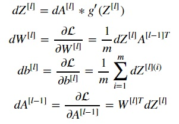
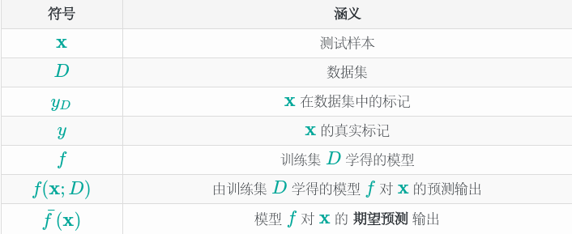
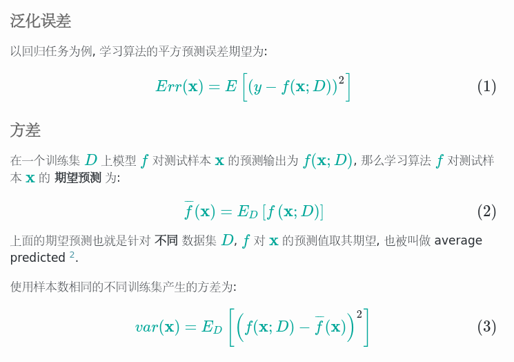
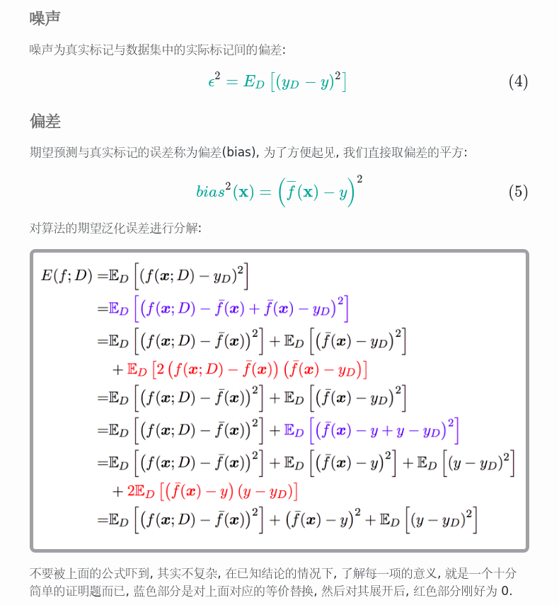
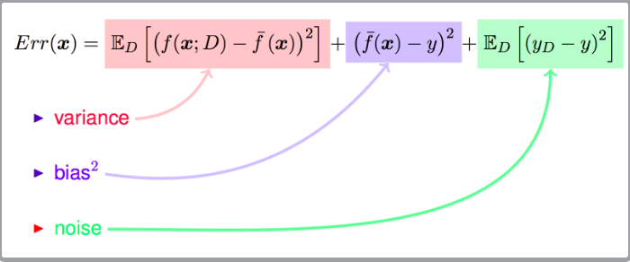
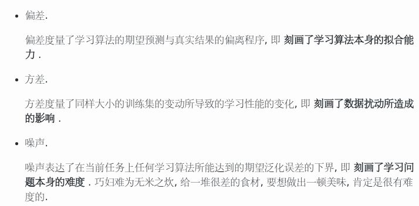
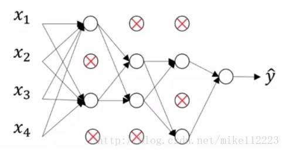
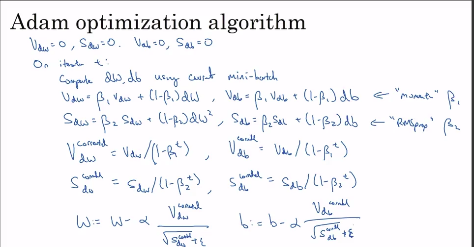

# The practice of Neural Network

## The overall method of Neural network
* define the struct of neural network(the number of input neurons, the number of hidden neurons)
* randomly initialize the model parameter
* step in train loop
  * foreward propagate
  * compute the cost function
  * backpropagate to get the gradient
  * update the parameter

## Some brief introduction to Neural Network
### activation function and it's derivatives
1. sigmoid function:

   g(z) = 1/(1 + e^-z)(d = g(z) * (1 - g(z)))

2. tanh function:

   g(z) = sinhz/coshz = (e^z - e^-z)/(e^z + e^-z)(d = 1 - g(z)^2)

3. ReLU function:

   g(z) = max(0, z)

4. Leaky ReLU function:

   g(z) = max(0.01z, z)

### the gradient of each element

### some explanation of the steps
#### forward propagate
for every layer, we need to store the prev_A, the W, the b, then the Z, so when we backpropagate, we can use this data to compute the dA, dZ, dW and so on
## Improving Deep Neural Networks
### train/dev/test sets
We often use the property:60:20:20, but if the data is too large, the test dataset and dev dataset's bigness will cause the waste of time of choosing hyper parameter
### Bias and Variance
introduction: generalization error can be three part:
bias, variance, noise(irreducible error)
* bias: the instance between the value and true value
* variance: dispersion

### Tell the problem
To tell if a model is high bias or high variance, we depend on the train error and dev error. But we also need a base error to compare with the train and test error.
### Basic recipe for the problem
High Bias
* bigger network(more complex network, more hidden layer, more hidden neuron)
* train longer or more complex algorthim
* NN architecture search(more neural network model)

High variance
* more data
* Regularization
* NN architecture search

### Regularizing your neural network
regularization is used to regularize our parameters to avoid the problem of high variance(over-fitting)
#### L1 norm
generate a sparse matrix for features choosing

For L1 norm, the cost function J is J = J0 + ∑|w|(L). What we need to do is optimize J0 under the limit of L.
Bellow are the contour of J0 and the graphic of L

When the contour of L meet with contour of M, J has the minimum value. Actually when the number of parameters(w) is big, the contour of L has so many sharp corner that there exist high probability that they meet in sharp corner, then it will generate so many zero coordinate, so the matrix will be sparse. Then a small number of features have an effect on the model. The alpha before the L will decide the bigness of the graphic of L, if thre alpha is bigger, then the graphic need to be smaller.

#### L2 norm
avoid overfitting

For L2 norm, first we need to know we tend to make the weight to be small, because it can fit more dataset, the deviation will be small; From other aspect, the small weight means small effect of neuron, at the same time means less number of neurons, means the model will be simple. Also, if weight is small, Z will be small, so for the activation function such as tanh, it will be near to the middle area. The model will be more linear and smooth.

 If we use the L2 norm, the iteration formula will be like this:

theta = theta(1 - alpha * lembda / m) - alpha * 1/ m ∑(h(xi) - yi) * xi(i is i to m)

For every iteration, the theta is smaller.Note that L1 can also reduce overfit, but it sometimes are not convenient to get its derivative. So often we use L2 to reduce the high variance.

#### Dropout Regularization

Dropout regularization means for data go into every layer, randomly dropout some neurons.
* Every time the number of neurons participate in computing is smaller. the model is relatively simple
* the compute times will be smaller, the weight value will spread out between one layer.

The most used method is called **Inverted dropout**. For every layer, after we drop out, we need to make A divide by keep_pob to return to the value what the neuron network have to be in order to avoid rescaling data when we use test dataset. The python code here:

'''

d3 = np.random.rand(a3.shape[0], a3.shape[1]) < keep-prob # this will make keep-prob of the number become 1, and (1 - keep-prob) of number become 0.

a3 = np.multiply(a3, d3)

a3 /= keep-prob 

'''
#### Other regularization methods
* Data Augmentation
* Early Stop
### setting up your optimization problem
#### Normalizing input
If the features' range is different from each other in a big degree, then the training process will be much harder. So we need to scale the data. The formula is just as fellows:

x = [x - mean(x)]/mean(x)

#### Vanishing/Exploding gradients
##### how Vanishing/Exploding gradients generate
If the layers is so deep, for one hundred layers and deeper, and if the wieight are all bigger than 1 a little bit, then finally the result is much bigger. Just like this, if the weight is smaller than 1 a litte bit, then the 
##### method for the problem
We aften use weight initialization.
For a single neuron example:

W[l] = np.random.randn(shape) * np.sqrt(a/n[l -1])(n is the number of unit feeding into each of the unit)

note: If you are using a ReLU activation function, you need to set the a to be 2, and if you use a tanh activation function, you need to set a to be 1.

#### gradient checking
#### Numerical approximation of gradients 
f'(theta) = [f(theta + ε) - f(theta - ε)]/2ε
#### gradient checking
gradient checking can help you find bugs in my implementations of backpropagation many times
* take W[1], b[1], W[2], b[2].. and reshape into a big vector θ
* take W[1], b[1], W[2], b[2].. and reshape into a big vector dθ
* J(θ) = J(θ1, θ2, ..), for each i, dθ(approx)[i] = [J(θ1, θ2, θi + ε, ..) - J(θ1, θ2, .., θi - ε, ..)]/2ε, and you need to check result = ||dθ(approx) - dθ||2/(||dθ(approx)||2 - ||dθ||2)
* we get ε a value like 10**-7, and if the result is like 10 ** -7, then it's great, if it's 10 ** -5, then maybe you should check the component of the vector.

note: 
* dont use it in training(every iteration), only to debug
* If a algorithm fails grad check, look at the certain components to try to identify bug.
* remember regularization(don't forget the L when using it)
* doesn't work with dropout
* Run at random initialization; maybe the algorithm is correct only when W and b is near to 0.

### optimization algorithms
#### Exponentially weighted average
V(t) = beta * V(t - 1) + (1 - beta) * theta(t)  [beta is recommended to be 0.9]

bias correction: V(t)/(1 - beta ^ t)
#### momentum and RMSprop and Adam
momentum

V(dw) = beta * V(dw) + (1 - beta) * dw

V(db) = beta * V(db) + (1 - beta) * db

w = w - alpha * V(dw), b = b - alpha * V(db)

RMSprop

S(dw) = beta * S(dw) + (1 - beta) * (dw) ^ 2

S(db) = beta * S(db) + (1 - beta) * (db) ^ 2

w = w - alpha * dw/S(dw)^1/2 

b = b - alpha * db/S(db)^1/2

Adam

